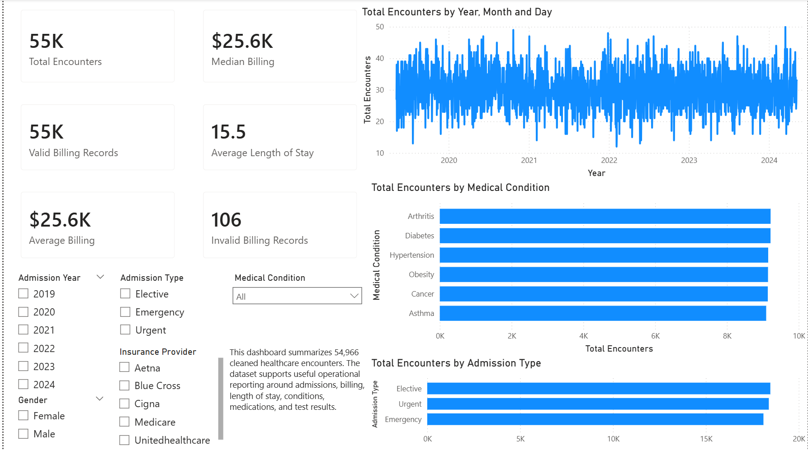
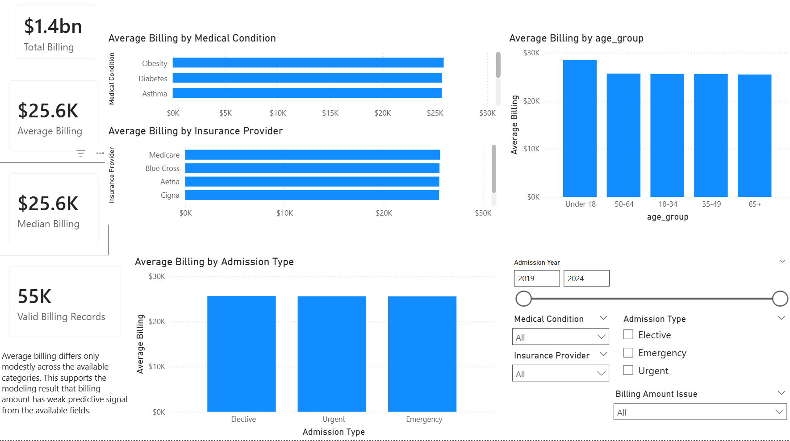
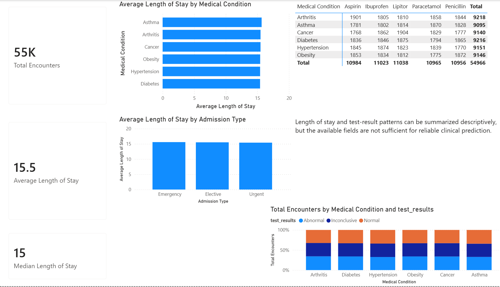

# Healthcare Encounter Analytics

This project combines **MySQL, Python, and Power BI** to clean, analyze, model, and visualize a 55,500-row healthcare encounter dataset.

The final analysis shows that the dataset is useful for **healthcare operations reporting**—billing summaries, admission trends, length-of-stay analysis, and test-result breakdowns—but weak for reliable predictive modeling. The available fields did not provide strong signal for predicting billing amount or test-result category.

## At a Glance

| Area | Detail |
|---|---|
| Dataset | 55,500 healthcare encounter records |
| Tools | MySQL, Python, Power BI |
| Skills shown | SQL cleaning, EDA, validation, baseline modeling, dashboarding, interpretation |
| Final cleaned rows | 54,966 |
| Final cleaned columns | 21 |
| Valid billing records | 54,860 |
| Key result | Descriptive analytics useful; predictive signal weak |
| Best use case | Healthcare operations reporting, not clinical prediction |

## Power BI Dashboard

### Executive Overview



### Billing Analysis



### Utilization & Outcomes



## Project Objective

Analyze a healthcare encounter dataset to identify billing, utilization, admission, and test-result patterns. The project includes data cleaning, exploratory analysis, Power BI dashboarding, and business interpretation.

## Dataset

Source: [Kaggle Healthcare Dataset by prasad22](https://www.kaggle.com/datasets/prasad22/healthcare-dataset)


- Admission date range: **2019-05-08 to 2024-05-07**
- Raw rows: **55,500**
- Cleaned rows: **54,966**
- Valid billing records: **54,860**

## Business Questions

1. How are encounters distributed by medical condition, admission type, payer, and test result?
2. Which conditions have the highest average billing amounts?
3. How does length of stay vary across conditions and admission types?
4. Can available encounter fields predict billing amount?
5. Can available encounter fields predict test-result category?
6. What dashboard views would be useful for operational reporting?

## Methods

- Imported and staged the raw CSV in MySQL.
- Standardized and cleaned fields.
- Removed exact duplicate rows.
- Flagged and excluded invalid negative billing values from billing analysis.
- Created derived fields for admission year, admission month, age group, and length of stay.
- Wrote SQL queries for validation, EDA.
- Used Python for additional exploratory analysis.
- Built Power BI dashboard pages for executive overview, billing analysis, and utilization/outcomes.
- Interpreted the results.

## Key Findings

| Metric | Result |
|---|---:|
| Average valid billing amount | $25,594.63 |
| Median valid billing amount | $25,593.88 |
| Average length of stay | 15.5 days |
| Duplicate rows removed | 534 |
| Negative billing values handled after deduplication | 106 |

This is an important analytical result: the dataset supports data cleaning, EDA, KPI reporting, and dashboarding, but it should not be presented as clinically predictive.

## SQL Workflow

The SQL portion of this project stages, cleans, validates, explores, and models the data using MySQL-oriented scripts.

```text
sql/01_create_and_load.sql
sql/02_clean_transform.sql
sql/03_eda_queries.sql
sql/04_sql_models.sql
sql/05_validation_and_export_queries.sql
